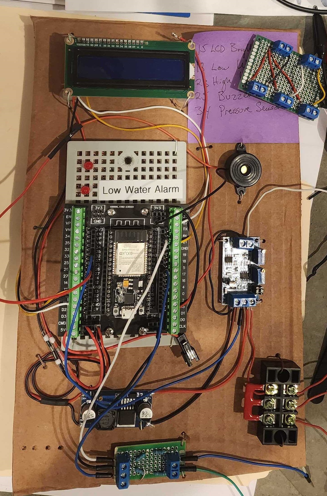
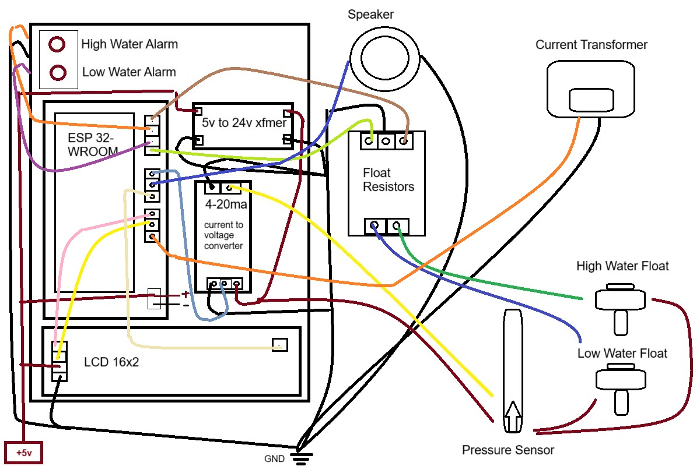

# Cistern Monitor

Uses several sensors measure the water level of a cistern and current draw from a 180 PSI irrigation pump
1) Pressure Sensor (https://www.amazon.com/gp/product/B07PXFPPMM)
2) Float Switch (https://www.amazon.com/gp/product/B095HMXX6G)
3) Current Transformer (https://www.amazon.com/gp/product/B07JNDRJQ4)
4) Flow Sensor (https://www.amazon.com/dp/B07MY6JHNR)
5) ADS1115 (https://www.amazon.com/dp/B01DLHKMO2)

FEATURES:
 - High Water Float sensor (cistern overflow alarm)
 - Low Water Float sensor (irrigation pump shutoff and alarm)
 - Real time water level feedback via WebSockets
 - HTML monitoring page
 - OTA firmware updates
 - WIFI SID and password via json config file

FIXME:
 - show all stats on HTML page load (first load is missing CT value)
 - send message to OpenSprinkler when low water alarm and CT current > 3amps

TODO:
 - sleep mode (add motion detector; wake on trigger)
 - Gateway, mask and IP address in config file
 - JS: if last websocket message > 5 seconds, then timeout
 - rewrite for Little FS and caching as per https://github.com/mathieucarbou/AsyncTCP/issues/14#issuecomment-2251584611
 - refactor arduino-libraries/Arduino_JSON usage to bblanchon/ArduinoJson @ 7.1.0 (which AsyncTCP uses)
 - remove <Arduino.h> includes
 - add water level to tab in parenthesis (<title>Cistern Water Level Monitor(43%)</title>)
 - refactor src\Cistern_Monitor_SPIFF.ino to main.cpp; erase all git hub history for src\Cistern_Monitor_SPIFF.ino to remove wifi credentials
    - https://docs.github.com/en/authentication/keeping-your-account-and-data-secure/removing-sensitive-data-from-a-repository
    - rename project to open-cistern ??
 - remove unnecessary trend detector stats code
 - add current measurement histogram
 - add timeout to realtime stats (turn off after 2 hours)
 - add timestamp to high/low water alarm
 - add flow sensor and stats
 - js notification API
 - move LCD code to lcd library directory
 - time pump running since low water alarm
 - time since last 0 current value (how long pump has been running)
 - toggle state for when filling (alarm will sound on both high float, water percentage and timeout 40 minutes)
 - MOSFET for 24v speaker alarm
 - MOSFET for 24v float/pressure sensor loop for sleep mode / real-time stats

REFACTORING:
 - use Arduino Nano Matter
 - changing wiring to 10 wire pins with ADC1115, buck converter, ESP32 PCB blocks on single board
 - single board contains voltage dividers, MOSFETs, etc
 - no terminal blocks / use wire adapter

RESEARCH/IDEAS:
 - use openthings to iframe app for remote
 - curl post rain delay to open sprinkler on LOW_WATER_ALARM
 - use Arduino Nano Matter
 - integrate with Home Assistant

SCRATCH PAD:

ESP32 ACD ranges:
2450v
1750v
1250v

ADS1115 ranges:
-0.256V ~ + 0.256V
-0.512V ~ + 0.512V
-1.024V ~ + 1.024V
-2.048V ~ + 2.048V
-4.096V ~ + 4.096 V
-6.144V ~ + 6.144V

resistor calculations
========
Pressure Sensor
0.011 A * x = 4v
x=360 ohms

0.011 A * x = 3.85v
x=350 ohms

x * 360 = 1.68
========

========
Float Switch
vs=24v
r1=3000
r2=330
vout=2.378
========

.012 * x = 3
0.0106 * x = 2.45v

0.011 * x = 2.45v
x=222

x=220 = 2.332v

y * 165 = 1.763

y = 0.01068 A
10.68 mA

283 ohms at 3v
330 ohms at 3.49v

?? ohms at 2.450v

cistern:
 - get max pressure sensor value
 - add intake check valve

